# C_Class | machine learning
### [Class curriculum link](https://github.com/mokahaiku/toai_workshops/tree/master/C_Class)


## **SPRINT 1**

## Intro to Machine Learning | Kaggle | 1 - 5 Modules
- Decision trees - simple explanation how they work (House value predicted decisions tree, based on questions, rooms more than 2?, then this price)
- Importance to familiarise with data using Pandas, as data may be old, missing values,
thus model would not perform well given inacurate, old data on new examples.
- Building DecisionTree model with Scklearn to predict price based on selected features: Rooms, Bathrooms, Long,Lat
- Using Decision tree model to build ML predicting prices of Iowa house prices
- Feature selection & Prediction selection - explaninig how to select features and prediction target
- Model traininig - explaninig how to train model


## ML FAST.AI - LESSON 1

- Sckitlean library is most impornat and popular ML library in python
- Kaggle is great source to learn with competitions
- It's always important to look into your data and understand it
- Regresson - to predict continous data , Classifier - to predict categorical variables
- Regression - is ML model tryign to predict continuous outcome/variable
- Datetime contains a lot of information, good source for Feature engineering, dependent on your target
- Ordered some categorical ordinal data
- No harm in adding extra columns to your dataset (So go ahead)
- Feather - some light and fast way of loading,saving data
- Some great Fastai premade structures (def proc_dc, numeralize, fix_missing etc) - He used datas well, worked with missing values etc., and
got really great results, well at least - 25%


## Machine Learning with Python - Coursera
- ML =  Ability to learn without explicitly programmed.
- Basics of ML, Attributes, features, prediction target etc.
- Supervised and Unsupervised ML 
- What is classification - to predict class
- Regression is to predict continuous data


## **SPRINT 2**

## Kaggle: Intro to Machine Learning - Model Validation - Underfitting and Overfitting

- **Model Validation** - How good is your mode? 

    - One of the possible metrics is Mean Absolute Error.

    - It's important to validate data that model has not seen before.

    - **Train_test_split**, used to break up the data into two pieces (Train and Test)

    - Building simple model to predict house prices with Decision Trees, training & validating

    - Simple practical lesson to predict price with DT and MAE calculation.

- ### Underfitting and Overfitting
    - **Overfitting**: capturing spurious patterns that won't recur in the future, leading to less accurate prediction

    - **Underfitting**: failing to capture relevant patterns, again leading to less accurate predictions.

    - Use validation to measure accuracy

    - Practice, DT model with various max_leaf_nodes to find lowest MAE and use it for model.


## ML FAST.AI - LESSON 2 — RANDOM FOREST DEEP DIVE
- Creating a validation set is the most important thing you need to do when you are doing a machine learning project

 - %time, it will tell you how long things took

 - Building a single tree - with n_estimators=1, max_depth=3, and visualising it, to see how it's done.

- Random forest — a way of bagging trees. if we created five different models each of which was only somewhat predictive but the models gave predictions that were not correlated with each other. average of those five models, you are effectively bringing in the insights from each of them. So this **idea of averaging models** is a technique for Ensembling.

- Purpose of modeling in ML is to find a model which tells you which variables are important and how do they interact together to drive your dependent variable.

- The effective machine learning model is accurate at finding the relationships in the training data and generalizes well to new data 

- Suggestion when starting to build RF models, use less trees, and only later use large - as it takes a lot of computing.

- oob_score=True - would use unused rows through the first tree and treat it as a validation set

- **Grid search**. Scikit-learn  function, where you pass in a list of all the hyper parameters you want to tune and all of the values of these hyper parameters. It will run your model on every possible combination of all these hyper parameters and tell you which one is the best.

- **ERROR -** Most people run all of their models on all of the data all of the time using their best possible parameters which is just pointless.

    - **TIP** Do most of your models on a large enough sample size that your accuracy is reasonable (within a reasonable distance of the best accuracy you can get) and taking a small number of seconds to train so that you can interactively do your analysis.

- **min_samples_leaf=3** - Stop training the tree further when a leaf node has 3 or less samples. We are taking the average of at least three points that we would expect the each tree to generalize better. (Recommended values: 1,3,5,10,25)

- **max_features=0.5** - So if every tree always splits on the same thing the first time, you will not get much variation in those trees. 
  - This param, indicates to every split from different subset of columnts. 
  - 0.5 means randomly choose a half of them.
  - Good values to use are 1, 0.5, log2, or sqrt

- **Why Random Forest works so well?** With just two splits, we can pull out a single category. Tree is infinitely flexible even with a categorical variable

## Machine Learning with Python - Coursera - Regression

- Regression is the process of predicting a continuous value (Stock price, car CO2 emissions rate, sales etc..)

- In regression, two ypes of variables, a dependent variable, and one or more independent variables. 
    - Dependent - target we study
    - Indendent are the causes of of dependent variable
        - *Simple Regression* is when one independent variable predicts dependent
        - *Multiple Regression* is when two or more variables used to predict Dependent varaibles.
    
    - Linear regresions is:
        - Fast
        -  Easy to unrderstand and interpert
        - No need tuning
- Traininig and Testing (Train test split.) Testing data on same dataset that was used to train is not a good idea. It's good to use Train Test split, to split data into test and train. So that testing can be done on date that model hasn't seen.

    - **Evaluation metrics**
        - In The context of regression, the error of the model is the difference between the data points and the trend line generated by the algorithm. 
        - Various Metrics:
            - Mean Absqolut Error (MAE)
            - Mean Squared Error (MSE)
            - Root mean squared errro (RMSE)

    - Practice exercice: Building **simple linear regresion model**, using one variable Car Engine size to predict CO2 emissions.
         
    - When using regression, it's good to check feature relationship to target. If it's linear then using *linear regresion* is good. If it's not linear, then its worth using *non-linear regression.*

    - Practice exercice: Bulding **multiple linear regression model** with multiple params, to predict CO2 Emissions.

    - Non-linear regression is model of non-linear relationship between the features and the target variable.
    
    - How to know if problem is linear or non-linear? **Inspect Visually**, **Check correlation coeafficient if > 0.7** - there is linear tendency.

## Workshop:

- Feature engineering is usually the key in winning competitions
- ML deals exclusively with numeric values, thus data must be preprocessed before it can be used:

    - One hot encoding
    - Label encoding
    - Buckets encoding (hashing)
    - Embedings

- ML also does not know if data is ordinal or not ordinal, thus presenting it correctly may have different outcome on the model.

- Label encoding is fine for Random Forest model, but it's not good on other regresion models, because those models will assume that higher values on labels have mathematically higher significance.

- Random Forrest Regression drawback, model can not predict values out of the value range that model has seen. So if you are trying to predict some prices or value that may be higher or lower than the values indicated, RF Regresson will never be able to do that.
    

## **SPRINT 3**

## [Kaggle: Random Forests](https://www.kaggle.com/dansbecker/random-forests)

- The **Random Forest** uses many trees, makes a prediction by averaging the predictions of each component tree. It generally has much **better predictive accuracy** than a **single decision** tree and it **works well with default parameters**.


## [Kaggle: Exercise: Machine Learning Competitions](https://www.kaggle.com/valdem/exercise-machine-learning-competitions/edit)

ML competitions are a great way to improve your DS skills and measure your progress. 

Built a simple Random Forest model to predict IOWA house prices. (Validation MAE for Random Forest Model: 21,857)

## [ML FAST.AI - LESSON 3 — PERFORMANCE, VALIDATION AND MODEL INTERPRETATION](http://course18.fast.ai/lessonsml1/lesson3.html)

- Random Forests allow us to understand models deeper than other models.

- Example of reading large dataset, using 
dtypes = types, where give only int8, int32, float32 - fewer bits to data that doesnt need 64 bits etc..

- Analysing the grocery shop sales prediction. There is 4 years data to predict 2 weeks of sales. Probably you may want to use only more recent data, than full 4 years.

- **Profiling** - %prun - is a form of program analysis that measures, for example, the space (memory) or time complexity of a program, the usage of particular instructions, or the frequency and duration of function calls. 

- External data, metadata such as weather data could be a good additional extra source to tweak your model for better results.

- You need a validation set, which is reliable. Usually models which perform well on validation set, achieve better results on Kaggle too. So good validation set is good meter of your model.

- Jeremy most of the time uses smaller datasets, to just get a good generalization, not a perfect model, to save time on traininig.

- If the standard deviation is high, that means each tree is giving us a very different estimate of this row’s prediction.
**Standard deviation** of the predictions across the trees gives us at least relative understanding of how confident we are of this prediction. 
    - On average, when you are predicting something that is a bigger number your standard deviation would be higher. (In example variables with least examples, had weakest confidence)

- **Feature Importance** in data differs. Some features are important others are less important. 
    - Removing unnecessary columns shouldn't make a model worse.


**FEATURE IMPORTANCE - can be used on any ML Model**


1. We have Target 
2. We have Features
3. We build model with feature to predict target
4. Model spits predictions for data. We will then compare them to the actual price (in this case, we get our root mean squared error and r²). Assume r² was .89. 
5. We take one Feature and randomly shuffly it
6. Make predictions with shuffled data. Now r² is .80
7. Diference from Actual and randomed is the **Feature Importance**, difference in our example is .09.


## [Machine Learning with Python - Coursera - Classification](https://www.coursera.org/learn/machine-learning-with-python)


**Classification** - categorizing or classifying some unknown items into a discrete set of classes.
- Binary - predicts two categories. 
- Multi-class can predict multiple 2+ categories.

**Use cases:**   email filtering, speech recognition, handwriting recognition, biometric identification, document classification and much more. 

**Models** used for classification: decision trees, naive bayes, linear discriminant analysis, k-nearest neighbor, logistic regression, neural networks, and support vector machines

- **K-Nearest Neighbours** - clasifies cases based on nearest neighbours.
    - Different calculations for KNN: Euclidian distance,
    - We specify K value, how many neighbours should be used
    - Low K - overfitting, High K - underfitting. We need model that generalazes well. 
    - Choose K which achieves best accuracy on validation

**Evaluation metrics in classification**: Jaccard index, F1-Score (Confussion Matrix- Shows nicely how model classified wrong and good parameters), log loss.

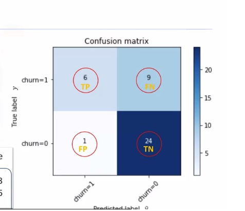

Testing KNN in practice - classifying telecomunications customers.

**Decision Tress**

Another good model for Classification. Clasifices by splitting data by feature into different leaf nodes.

Example. If Person is middle-age, he sould use B. If person is younger and older, needs further questioninig.

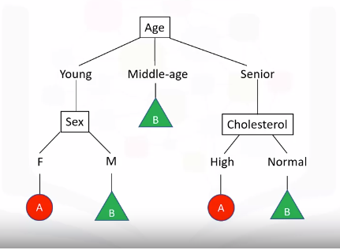

- Built simple DT model to predict which drugs to prescribe for patients

**Logistic Regression**
Anothre Classification Algorithm. Analogous to linear regression, but here it tries to predict categorical variable.
- ***Applications:*** Predict probability of heart attack based on data, predict chance of mortality in injured patients based on data, predict likelyhood of customer to predict a purchase, likelihood of person defaulting on a mortgage etc...

- Variables should be transformed to continuous/numerical


**Linear regression** is **not good for classification** task. Thus Logistic (Sigmoid) Regression is an alternative to linear but for classification.


**Support Vector Machines (SVM)**
Can be used as a classifier to classify cases by finding a separator.

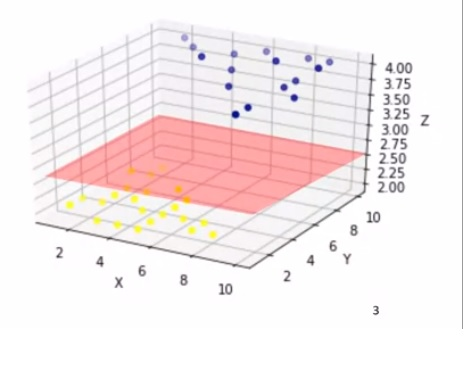

**Applications:**
- Image recognition (Hand written digit recognition)
- text category assignment
- Detecting spam
- Gene expression classification
- Regression, outlier detection and clustering.

**How it works**
- It maps data to high-dimensional feature space
- Kernelling: Mapping data into a higher dimensional space, in such a way that can change a linearly inseparable dataset into a linearly separable dataset.

**Pros: **
- Accurate in High dimensional spaces
- Memory efficient

**Cons:**
- Prone to over-fitting (if features > samples)
- No probability estimations
- Small datasets, not very efficient computationally

## Workshop:

**Unsupervised learning**- not so easy to define. e.g. model recognizes objects and puts them into different groups, this probably is best visualised grapically when you see differnt clusters that you can differentiate, and where you evetually give them names to these separate regions... 

**Principal Component Analysis** - Unsupervsied model algorithm. When you have many data with a lot of features and little feature importance, PCA comes handy. It reduces dimensionality from hundreds or more into few. It's usefull when visualising something with many features, it's also good way of compressing some model.

**ML models for unstructured data** - it turns out that it's possible to use ML models such as SVM on unstructured data, such as image recognition (written digit recognition). Although it's not very smart to use these model for such problems, as it will be inefficient.

**Unbalanced datasets** - Datasets where there are different proportions of data, some data is in large quantities, whilst other important is not, which makes datasets unbalanced, this may couse problems, that model will not perform well. Thus in such cases you should not trust usual metrics and **Precision & Recall metrics** must be taken into account.

-  Handy tool for Unbalanced datasets metrics = **Classification_report**, you should check Accuracy vs macro avg. Where macro avg is important metric to look at, if it's below accuracy, means your model is predicting wrongly the unbalanced sets.

- Solutions for unbalanced datasets:

    - Oversampling - increasing samples of minorities (Copying more of them)
    - Undersampling - reducing samples of majorities (Deleting from data)

- Interesting but for Random Forests Unbalanced datasets are not so big probolem.


## **SPRINT 4**

## [Kaggle: Intermediate Machine Learning](https://www.kaggle.com/learn/intermediate-machine-learning)

**Dealing with missing values** 
Most ML libraries (including scikit-learn) give an error if you try to build a model using data with missing values. Thus something must be done with missing values.

1) **Drop Columns with Missing Values** - Unless most values in the dropped columns are missing, the model loses access to a lot of (potentially useful!) information with this approach.

2) **Imputation** (Better option) - fill in the missing values with some number. For instance, we can fill in the mean value along each column.

3) **An Extension To Imputation** -  imputed values may be systematically above or below their actual values, model would make better predictions by considering which values were originally missing. **Approach:** we impute the missing values, as before. And, additionally, for each column with missing entries in the original dataset, we add a new column that shows the location of the imputed entries.

Sckinglearn tool **SimpleImputer**, SimpleImputer(strategy='median') can b used to impute missing data with your chosen strategy.

Test exercise - model predicting prices with doropped columns on missing data nd with Imputed missing values. **Imputed model performs better on validation.**


## [ML FAST.AI - LESSON 4 — FEATURE IMPORTANCE, TREE INTERPRETER](http://course18.fast.ai/lessonsml1/lesson4.html)

- **Bagging** - random forrest does produce many separate estimators where each estimators is it's possible best, but also the esimators are different from each other minimazing the correlation between themselves.


Key basic parameteres discussed:

- **min_leaf_nodes = 2** With larger parameter, we are going to get a more stable average. Each estimator would be less predictive, but the estimators would be also less correlated. So this ***might help us avoid overfitting.***

- **max_features = 0.5** - indicates how many features should be taken at each splint. In this case at each split it will be using only 50% of columnts. 

    - Can give us more variation and therefore it can help us to create more generalized trees that have less correlation with each other even though the individual trees probably won’t be as predictive.


- **Feature importance** - discussed further how it's determined, good and bad ways to determine it. 

    - Removing low importance features, may help slightly increase model accurecy or keep it the same, but now model is simplier.
    - Also new feature importance on improved model may show different importance than previously. 


- When we build RF model, he takes into numerical data and he doesn't know that data was categorical. He just sees numbers.

    - **Label econding is a little inefficient and we are wasting tree computation.** So it’s going to make our tree less rich and less effective if we are not giving the data in a way that is convenient for it to do the work it needs to do. (because every time we do a split, we are halving the amount of data at least that we have to do more analysis)

    - Instead, **One-hot encoding** is a good solution. It create separate columns for every different label. This encoding is neecessary for most of the models, like linear ones, as label encoding is not good. (But not all machine learning needs it)

    - Suggest always to try one-hot encoding with 6-7 max for features columns and checking how model performs with One-Hot. Others can be Label encoded. 

    - **Corelation Matrix - Dendogram** find which features are similar, kind of a correlation. Helps to find similar columns so they can be reduce/removed one of the similar.

    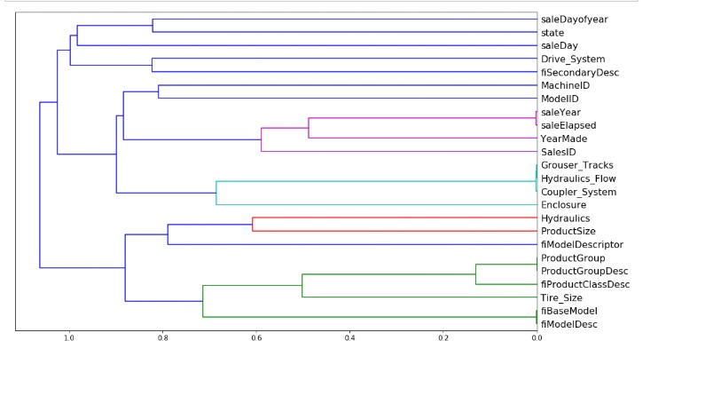

    - He checked with oob_score how models perform without specific column, and removes those few which are repetitive. 

    **Partial dependence** - By removing all these externalities, it often allows us to see the truth much more clearly. Introduced to Partial Dependec Plot (PDP)

    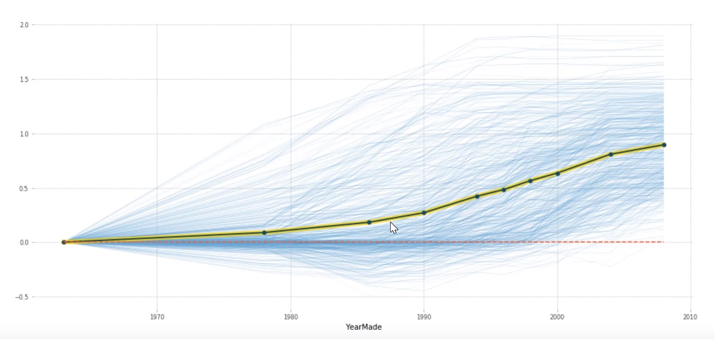
    Purpose of PDP interpretation is to learn about a dataset and so why do you want to learn about a dataset? Simply to understand how things are related to each other.


**Tree Interpreter** - To look at how the model makes prediction for an individual row.

- Super important in real life
- Not very important in Kaggle

## [Machine Learning with Python - Coursera - Clustering](https://www.coursera.org/learn/machine-learning-with-python)

- **Unsupervised** task, where datset is segmented into number of groups based on data similarities.

- Clustering means finding clusters in a dataset, unsupervised.

- A cluster is a group of data points or objects in a dataset that are similar to other objects in the group, and dissimilar to datapoints in other clusters.

- **Clustering vs Classification**

    - Clasification is a supervised learning where each training data instance belongs to a particular class. Data is labeled.


    - Clustering, data is unlabeled and the process is unsupervised. E.g, use a clustering algorithm such as k-means to group similar customers as mentioned, and assign them to a cluster, based on whether they share similar attributes, such as; age, education, and so on. 

**Applications:**
- Identify buying patters of customers
- Recommend new books or movies to new customers
- Fraud detection in credit card use
- Identify clustes of customers (e.g. loyal)
- Auto-categorize news based on content
- Recommend similar news articles (Tag artciles)
- Cluster genes with similar expresion patters
- based on genes identify family ties

**Why?** clustering can be used for one of the following purposes:
-  exploratory data analysis, 
- summary generation or reducing the scale
- outlier detection- especially to be used for fraud detection or noise removal, 
- finding duplicates and datasets
- as a pre-processing step for either prediction, 
- other data mining tasks or as part of a complex system

**Clustering Algorithms**
- Paritioned-based clusterings (K-means, k-median, Fuzzy c-means)
- Hierarchical Clustering (Produces tress of clusters)
- Density-based clustering (produces arbitrary shaped clusters)

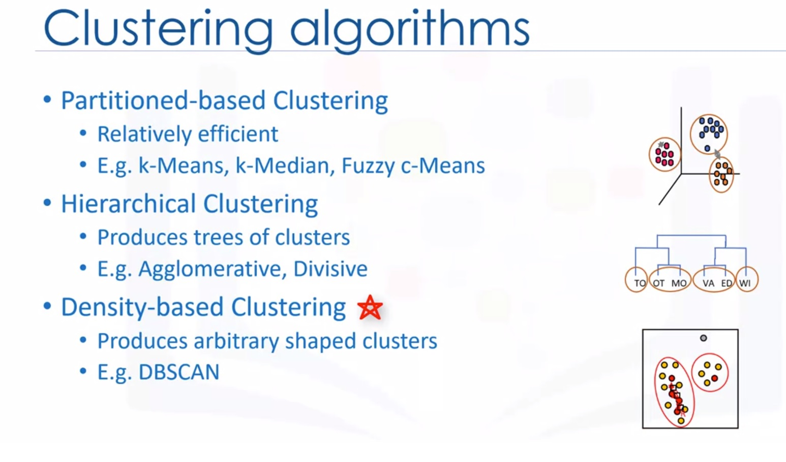


## **K-Means**

An **unsupervised** algorithm, groups data only based on the similarity to each other.
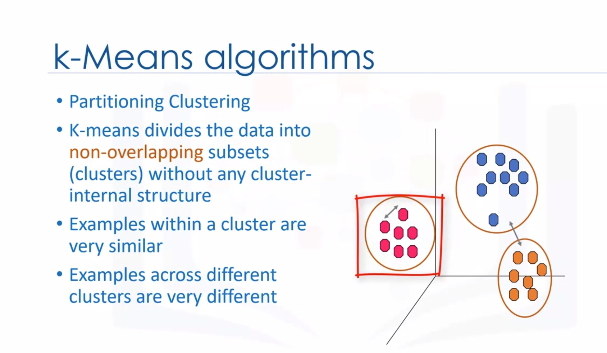

Logic: K-Means tries to minimize the intra-cluster distances and maximize the inter-cluster distances.
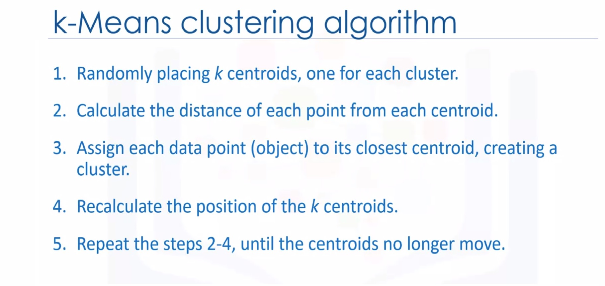

Exist various different distance measures: Euclidean distance, Cosine similarity, Average distance, and so on.

**We must initialize k**=3, indicating how much clusters we expect to receive from a model.

**Chosing K, Elbow method** where the rate of decrease sharply shifts. It is the right K for clustering. 
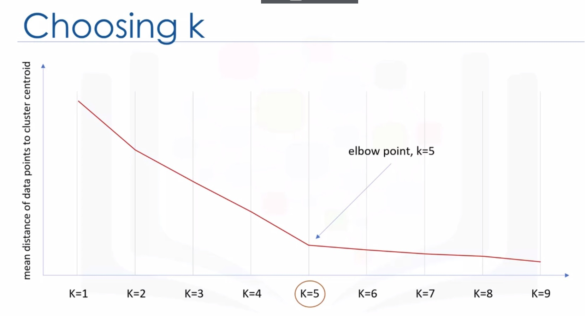


## **Hierarchical Clustering**
Types:
- Devisive, so you start with all observations in a large cluster and break it down into smaller pieces 

- **Agglomerative** (mostpopular among DS), it is bottom up, where each observation starts in its own cluster and pairs of clusters are merged together as they move up the hierarchy.

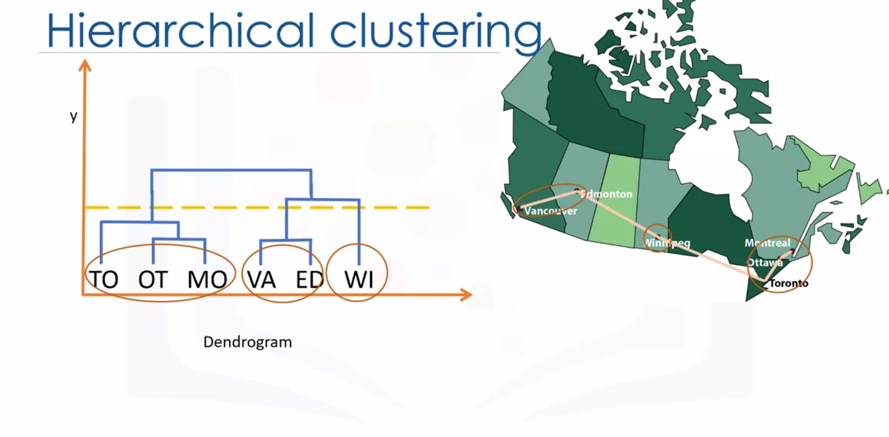

Metrics possibilities:
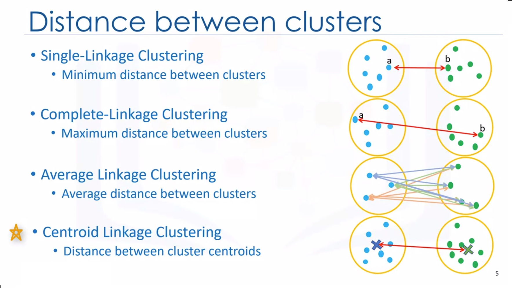

Advantages vs disadvantages:
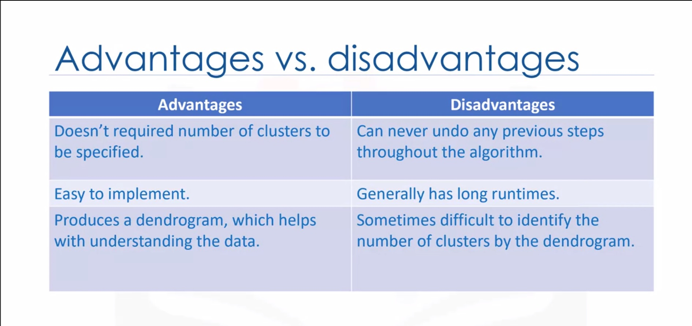

Kmeans vs Hierarchical:
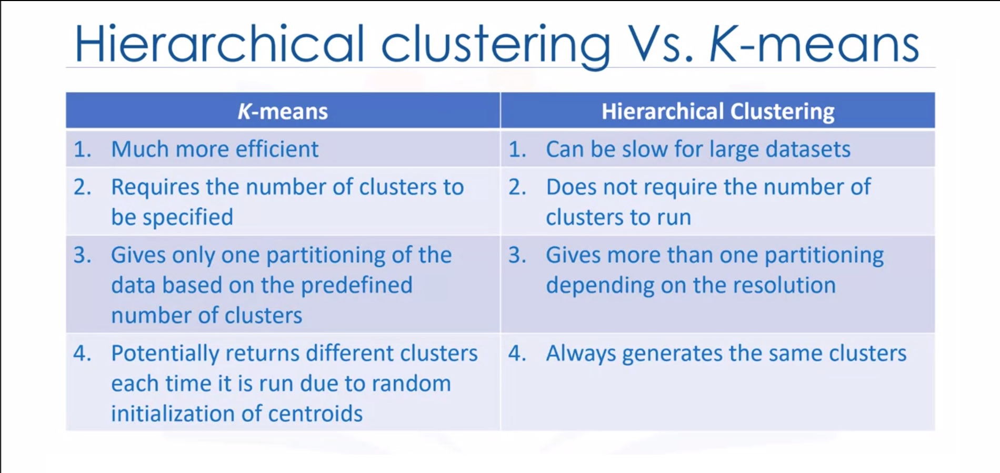


## **DBSCAN Clustering**
A density-based clustering algorithm which is appropriate to use when examining spatial data

Traditional clustering techniques such as K-Means, hierarchical when applied to tasks with arbitrary shaped clusters or clusters within clusters, might not be able to achieve good results, elements in the same cluster might not share enough similarity or the performance may be poor

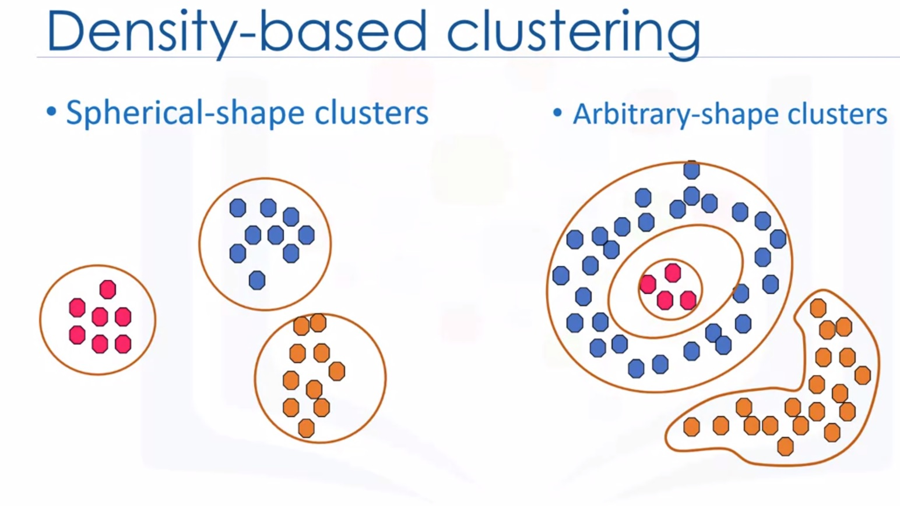

**K-means model for instance assignes**0 all points to cluster, **even outliers**, whilst Density based locates clusters and separates outliers.

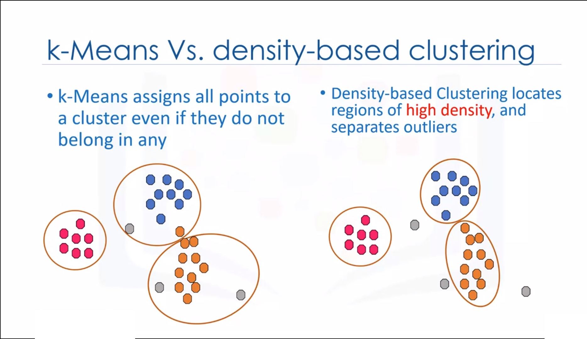

**Density-Based Spatial Clustering of Applications with Noise (DBSCAN)**
- Wonderful attributes of the DBSCAN algorithm is that it can find out any arbitrary shaped cluster without getting effected by noise.


## **SPRINT 5**

## [Kaggle: Intermediate Machine Learning - Categorical variables  ](https://www.kaggle.com/learn/intermediate-machine-learning) 

**Categorical variables** - are usuelly strings, with some value. For instance Gender, Education, Occupation etc. 

Approaches to deal with Categorical data:

1. **Drop Categorical Variables** easiest approach, it work well if the columns did not contain useful information.

2. **Label Encoding**


This approach assumes an ordering of the categories: "Never" (0) < "Rarely" (1) < "Most days" (2) < "Every day" (3). 

Not all categorical variables have a clear ordering in the values, but we refer to those that do as ordinal variables. Tree-based models (like DT and RF), you can expect label encoding to work well with ordinal variables, whilst **other models won't work well in label encoding.**

3. **One-Hot Encoding**
One-hot encoding creates new columns indicating the presence (or absence) of each possible value in the original data. To understand this, we'll work through an example.


**One-hot encoding does not assume an ordering of the categories**. Thus, you can expect this approach to work particularly well if there is no clear ordering in the categorical data (e.g., "Red" is neither more nor less than "Yellow"). We refer to categorical variables without an intrinsic ranking as **nominal variables**.

One-hot encoding generally **does not perform well if the categorical variable takes on a large number of values** (i.e., you generally won't use it for variables taking more than 15 different values).


## [ML FAST.AI - LESSON 5 — EXTRAPOLATION AND RF FROM SCRATCH](http://course18.fast.ai/lessonsml1/lesson5.html)

In machine learning, the thing we care about is the generalization accuracy or the generalization error. **Generalization** is the key unique piece of machine learning. 

### **What if model doesn’t generalize well?**
1. We generally do is we **put aside** a second dataset (**validation set**). 
2. Then  we **train a model** & **check it against the validation** to see if it generalizes, do that a few times. 
3. Then when we finally got something we think will generalize successfully based on the validation set (at the end of the project), we **check it against the test set**.

In Random Forest, OOB can be used insted of Validation set. But it is less good:

-  **Because every row is going to be using a subset of the trees to make its prediction, and with less trees, we know we get a less accurate prediction.**

### **Why might I not be able to use a random sample from my validation or possibly fail?**

By using a random validation set, we could get totally the wrong idea about our model. important thing to remember is when you build a model, you always have a **systematic error** which is that **you’re going to use the model at a later time than the time you built it**.

You’re using **data which is older than today anyway**. So there’s some lag between the data that you are building it on and the data that it’s going to actually be used on in real life. And a lot of the time, if not most of the time, that matters.

So what we want to do in practice, anytime there is some temporal piece is to instead say assuming that we’ve ordered it by time, we’ll use the latest portion as our validation set. I suppose, actually do it properly:

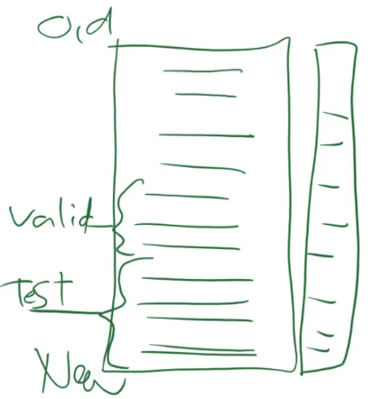

- Train on oldest data
- Validate on newest data
- Test even on newer data

As our goal is to predict things that will happen in future.

**OOB,** a really good reason to have OOB. If it looks good on the OOB then it means you are not **overfitting in a statistical sense.** 

Suggest making multiple models and check validations, checking them against accuracy on test. 

In real life making/keeping **correct test set is The most important thing**. Because if you failed to build a model which generalizes properly, your test dataset will show it. But if you failed to have good test set, you are going to build wrong model and if deployed in production can be demaging.

## sklearn **train_test_split**, **cross-validation** 
- Fact that these things **always give you random samples** tells you that much if not **most of the time, you shouldn’t be using them.**
- Fact that random forest gives you an OOB for free, it’s useful but only tells you that this generalizes in a statistical sense, not in a practical sense


### **Cross validation** 
Pulls out five validation sets, for example. So let’s assume that we’re going to randomly shuffle the data first of all. This is critical.

1. Randomly shuffle the data.
2. Split it into five groups
3. For model №1, we will call the first one the validation set, and the bottom four the training set.
4. We will train and we will check against the validation and we get some RMSE, R², etc.
5. We will repeat that five times, and we will take the average of RMSE, R², etc, and that is a cross-validation average accuracy.

### Pros:

You can **use all of the data**. You don’t have to put anything aside. And you get a little benefit as well in that you’ve now got five models that you could ensemble together, each one used 80% of the data. So sometimes that ensemble can be helpful.

### Cons:
1. Slow / Takes more time. We have to fit five models rather than one, so time is a key downside. If we are doing deep learning and it takes a day to run, suddenly it takes five days or we need 5 GPUs.

2. It uses random validation sets, are a problem are entirely relevant here. If your model may not be appriate to use random set, then Cross-Validation is not good for you. 

Most of the time in real world you may not need cross-validation (Just sometimes.) It's easy, interesting, but not that often that may be important in your toolbox, maybe just sometimes.


**Extrapolation problem of RF**.
Linear model can find a relationship between time and price, and predict something in the future. But **random forest can’t do that**.

- One simple way is just to try to **avoid using time variables as predictors** if there’s **something else** we could use that’s going to give us a better or stronger relationship that’s actually going to work in the future

if I understand the difference between our validation set and our training set, then that tells me what are the predictors which have a **strong temporal component** and therefore they may be irrelevant by the time I get to the future time period.

## Do you have random test set? 

In Kaggle you don't know if test set is random or not. Trick to find out:

1. Put test set and training set together
2. Create a new column called is_test 
3. If you can, you don’t have a random sample which means you have to figure out how to create a validation set from it.

```
m = RandomForestClassifier(n_estimators=40, min_samples_leaf=3, max_features=0.5, n_jobs=-1, oob_score=True)
m.fit(x, y);
m.oob_score_
0.99998753505765037
```
Test set is not random, because my validation set can be predicted with a .9999 R².

- So drop time related features, which can be dropped, and keep the rest so model predicts better on features that are not time dependent.

## Writing Random Forest from scratch! 

Basic explanation and building models from scratch our selfs using Pythons OOP. OOP is super handy for Data Scientists, since librariers like Pytorch are entirely built with OOP.