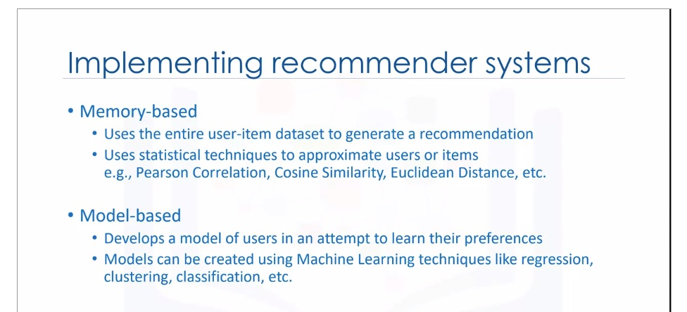

# C_Class | machine learning
### [Class curriculum link](https://github.com/mokahaiku/toai_workshops/tree/master/C_Class)


## **SPRINT 1**

## Intro to Machine Learning | Kaggle | 1 - 5 Modules
- Decision trees - simple explanation how they work (House value predicted decisions tree, based on questions, rooms more than 2?, then this price)
- Importance to familiarise with data using Pandas, as data may be old, missing values,
thus model would not perform well given inacurate, old data on new examples.
- Building DecisionTree model with Scklearn to predict price based on selected features: Rooms, Bathrooms, Long,Lat
- Using Decision tree model to build ML predicting prices of Iowa house prices
- Feature selection & Prediction selection - explaninig how to select features and prediction target
- Model traininig - explaninig how to train model


## ML FAST.AI - LESSON 1

- Sckitlean library is most impornat and popular ML library in python
- Kaggle is great source to learn with competitions
- It's always important to look into your data and understand it
- Regresson - to predict continous data , Classifier - to predict categorical variables
- Regression - is ML model tryign to predict continuous outcome/variable
- Datetime contains a lot of information, good source for Feature engineering, dependent on your target
- Ordered some categorical ordinal data
- No harm in adding extra columns to your dataset (So go ahead)
- Feather - some light and fast way of loading,saving data
- Some great Fastai premade structures (def proc_dc, numeralize, fix_missing etc) - He used datas well, worked with missing values etc., and
got really great results, well at least - 25%


## Machine Learning with Python - Coursera
- ML =  Ability to learn without explicitly programmed.
- Basics of ML, Attributes, features, prediction target etc.
- Supervised and Unsupervised ML 
- What is classification - to predict class
- Regression is to predict continuous data


## **SPRINT 2**

## Kaggle: Intro to Machine Learning - Model Validation - Underfitting and Overfitting

- **Model Validation** - How good is your mode? 

    - One of the possible metrics is Mean Absolute Error.

    - It's important to validate data that model has not seen before.

    - **Train_test_split**, used to break up the data into two pieces (Train and Test)

    - Building simple model to predict house prices with Decision Trees, training & validating

    - Simple practical lesson to predict price with DT and MAE calculation.

- ### Underfitting and Overfitting
    - **Overfitting**: capturing spurious patterns that won't recur in the future, leading to less accurate prediction

    - **Underfitting**: failing to capture relevant patterns, again leading to less accurate predictions.

    - Use validation to measure accuracy

    - Practice, DT model with various max_leaf_nodes to find lowest MAE and use it for model.


## ML FAST.AI - LESSON 2 — RANDOM FOREST DEEP DIVE
- Creating a validation set is the most important thing you need to do when you are doing a machine learning project

 - %time, it will tell you how long things took

 - Building a single tree - with n_estimators=1, max_depth=3, and visualising it, to see how it's done.

- Random forest — a way of bagging trees. if we created five different models each of which was only somewhat predictive but the models gave predictions that were not correlated with each other. average of those five models, you are effectively bringing in the insights from each of them. So this **idea of averaging models** is a technique for Ensembling.

- Purpose of modeling in ML is to find a model which tells you which variables are important and how do they interact together to drive your dependent variable.

- The effective machine learning model is accurate at finding the relationships in the training data and generalizes well to new data 

- Suggestion when starting to build RF models, use less trees, and only later use large - as it takes a lot of computing.

- oob_score=True - would use unused rows through the first tree and treat it as a validation set

- **Grid search**. Scikit-learn  function, where you pass in a list of all the hyper parameters you want to tune and all of the values of these hyper parameters. It will run your model on every possible combination of all these hyper parameters and tell you which one is the best.

- **ERROR -** Most people run all of their models on all of the data all of the time using their best possible parameters which is just pointless.

    - **TIP** Do most of your models on a large enough sample size that your accuracy is reasonable (within a reasonable distance of the best accuracy you can get) and taking a small number of seconds to train so that you can interactively do your analysis.

- **min_samples_leaf=3** - Stop training the tree further when a leaf node has 3 or less samples. We are taking the average of at least three points that we would expect the each tree to generalize better. (Recommended values: 1,3,5,10,25)

- **max_features=0.5** - So if every tree always splits on the same thing the first time, you will not get much variation in those trees. 
  - This param, indicates to every split from different subset of columnts. 
  - 0.5 means randomly choose a half of them.
  - Good values to use are 1, 0.5, log2, or sqrt

- **Why Random Forest works so well?** With just two splits, we can pull out a single category. Tree is infinitely flexible even with a categorical variable

## Machine Learning with Python - Coursera - Regression

- Regression is the process of predicting a continuous value (Stock price, car CO2 emissions rate, sales etc..)

- In regression, two ypes of variables, a dependent variable, and one or more independent variables. 
    - Dependent - target we study
    - Indendent are the causes of of dependent variable
        - *Simple Regression* is when one independent variable predicts dependent
        - *Multiple Regression* is when two or more variables used to predict Dependent varaibles.
    
    - Linear regresions is:
        - Fast
        -  Easy to unrderstand and interpert
        - No need tuning
- Traininig and Testing (Train test split.) Testing data on same dataset that was used to train is not a good idea. It's good to use Train Test split, to split data into test and train. So that testing can be done on date that model hasn't seen.

    - **Evaluation metrics**
        - In The context of regression, the error of the model is the difference between the data points and the trend line generated by the algorithm. 
        - Various Metrics:
            - Mean Absqolut Error (MAE)
            - Mean Squared Error (MSE)
            - Root mean squared errro (RMSE)

    - Practice exercice: Building **simple linear regresion model**, using one variable Car Engine size to predict CO2 emissions.
         
    - When using regression, it's good to check feature relationship to target. If it's linear then using *linear regresion* is good. If it's not linear, then its worth using *non-linear regression.*

    - Practice exercice: Bulding **multiple linear regression model** with multiple params, to predict CO2 Emissions.

    - Non-linear regression is model of non-linear relationship between the features and the target variable.
    
    - How to know if problem is linear or non-linear? **Inspect Visually**, **Check correlation coeafficient if > 0.7** - there is linear tendency.

## Workshop:

- Feature engineering is usually the key in winning competitions
- ML deals exclusively with numeric values, thus data must be preprocessed before it can be used:

    - One hot encoding
    - Label encoding
    - Buckets encoding (hashing)
    - Embedings

- ML also does not know if data is ordinal or not ordinal, thus presenting it correctly may have different outcome on the model.

- Label encoding is fine for Random Forest model, but it's not good on other regresion models, because those models will assume that higher values on labels have mathematically higher significance.

- Random Forrest Regression drawback, model can not predict values out of the value range that model has seen. So if you are trying to predict some prices or value that may be higher or lower than the values indicated, RF Regresson will never be able to do that.
    

## **SPRINT 3**

## [Kaggle: Random Forests](https://www.kaggle.com/dansbecker/random-forests)

- The **Random Forest** uses many trees, makes a prediction by averaging the predictions of each component tree. It generally has much **better predictive accuracy** than a **single decision** tree and it **works well with default parameters**.


## [Kaggle: Exercise: Machine Learning Competitions](https://www.kaggle.com/valdem/exercise-machine-learning-competitions/edit)

ML competitions are a great way to improve your DS skills and measure your progress. 

Built a simple Random Forest model to predict IOWA house prices. (Validation MAE for Random Forest Model: 21,857)

## [ML FAST.AI - LESSON 3 — PERFORMANCE, VALIDATION AND MODEL INTERPRETATION](http://course18.fast.ai/lessonsml1/lesson3.html)

- Random Forests allow us to understand models deeper than other models.

- Example of reading large dataset, using 
dtypes = types, where give only int8, int32, float32 - fewer bits to data that doesnt need 64 bits etc..

- Analysing the grocery shop sales prediction. There is 4 years data to predict 2 weeks of sales. Probably you may want to use only more recent data, than full 4 years.

- **Profiling** - %prun - is a form of program analysis that measures, for example, the space (memory) or time complexity of a program, the usage of particular instructions, or the frequency and duration of function calls. 

- External data, metadata such as weather data could be a good additional extra source to tweak your model for better results.

- You need a validation set, which is reliable. Usually models which perform well on validation set, achieve better results on Kaggle too. So good validation set is good meter of your model.

- Jeremy most of the time uses smaller datasets, to just get a good generalization, not a perfect model, to save time on traininig.

- If the standard deviation is high, that means each tree is giving us a very different estimate of this row’s prediction.
**Standard deviation** of the predictions across the trees gives us at least relative understanding of how confident we are of this prediction. 
    - On average, when you are predicting something that is a bigger number your standard deviation would be higher. (In example variables with least examples, had weakest confidence)

- **Feature Importance** in data differs. Some features are important others are less important. 
    - Removing unnecessary columns shouldn't make a model worse.


**FEATURE IMPORTANCE - can be used on any ML Model**


1. We have Target 
2. We have Features
3. We build model with feature to predict target
4. Model spits predictions for data. We will then compare them to the actual price (in this case, we get our root mean squared error and r²). Assume r² was .89. 
5. We take one Feature and randomly shuffly it
6. Make predictions with shuffled data. Now r² is .80
7. Diference from Actual and randomed is the **Feature Importance**, difference in our example is .09.


## [Machine Learning with Python - Coursera - Classification](https://www.coursera.org/learn/machine-learning-with-python)


**Classification** - categorizing or classifying some unknown items into a discrete set of classes.
- Binary - predicts two categories. 
- Multi-class can predict multiple 2+ categories.

**Use cases:**   email filtering, speech recognition, handwriting recognition, biometric identification, document classification and much more. 

**Models** used for classification: decision trees, naive bayes, linear discriminant analysis, k-nearest neighbor, logistic regression, neural networks, and support vector machines

- **K-Nearest Neighbours** - clasifies cases based on nearest neighbours.
    - Different calculations for KNN: Euclidian distance,
    - We specify K value, how many neighbours should be used
    - Low K - overfitting, High K - underfitting. We need model that generalazes well. 
    - Choose K which achieves best accuracy on validation

**Evaluation metrics in classification**: Jaccard index, F1-Score (Confussion Matrix- Shows nicely how model classified wrong and good parameters), log loss.


Testing KNN in practice - classifying telecomunications customers.

**Decision Tress**

Another good model for Classification. Clasifices by splitting data by feature into different leaf nodes.

Example. If Person is middle-age, he sould use B. If person is younger and older, needs further questioninig.


- Built simple DT model to predict which drugs to prescribe for patients

**Logistic Regression**
Anothre Classification Algorithm. Analogous to linear regression, but here it tries to predict categorical variable.
- ***Applications:*** Predict probability of heart attack based on data, predict chance of mortality in injured patients based on data, predict likelyhood of customer to predict a purchase, likelihood of person defaulting on a mortgage etc...

- Variables should be transformed to continuous/numerical


**Linear regression** is **not good for classification** task. Thus Logistic (Sigmoid) Regression is an alternative to linear but for classification.


**Support Vector Machines (SVM)**
Can be used as a classifier to classify cases by finding a separator.


**Applications:**
- Image recognition (Hand written digit recognition)
- text category assignment
- Detecting spam
- Gene expression classification
- Regression, outlier detection and clustering.

**How it works**
- It maps data to high-dimensional feature space
- Kernelling: Mapping data into a higher dimensional space, in such a way that can change a linearly inseparable dataset into a linearly separable dataset.

**Pros: **
- Accurate in High dimensional spaces
- Memory efficient

**Cons:**
- Prone to over-fitting (if features > samples)
- No probability estimations
- Small datasets, not very efficient computationally

## Workshop:

**Unsupervised learning**- not so easy to define. e.g. model recognizes objects and puts them into different groups, this probably is best visualised grapically when you see differnt clusters that you can differentiate, and where you evetually give them names to these separate regions... 

**Principal Component Analysis** - Unsupervsied model algorithm. When you have many data with a lot of features and little feature importance, PCA comes handy. It reduces dimensionality from hundreds or more into few. It's usefull when visualising something with many features, it's also good way of compressing some model.

**ML models for unstructured data** - it turns out that it's possible to use ML models such as SVM on unstructured data, such as image recognition (written digit recognition). Although it's not very smart to use these model for such problems, as it will be inefficient.

**Unbalanced datasets** - Datasets where there are different proportions of data, some data is in large quantities, whilst other important is not, which makes datasets unbalanced, this may couse problems, that model will not perform well. Thus in such cases you should not trust usual metrics and **Precision & Recall metrics** must be taken into account.

-  Handy tool for Unbalanced datasets metrics = **Classification_report**, you should check Accuracy vs macro avg. Where macro avg is important metric to look at, if it's below accuracy, means your model is predicting wrongly the unbalanced sets.

- Solutions for unbalanced datasets:

    - Oversampling - increasing samples of minorities (Copying more of them)
    - Undersampling - reducing samples of majorities (Deleting from data)

- Interesting but for Random Forests Unbalanced datasets are not so big probolem.


## **SPRINT 4**

## [Kaggle: Intermediate Machine Learning](https://www.kaggle.com/learn/intermediate-machine-learning)

**Dealing with missing values** 
Most ML libraries (including scikit-learn) give an error if you try to build a model using data with missing values. Thus something must be done with missing values.

1) **Drop Columns with Missing Values** - Unless most values in the dropped columns are missing, the model loses access to a lot of (potentially useful!) information with this approach.

2) **Imputation** (Better option) - fill in the missing values with some number. For instance, we can fill in the mean value along each column.

3) **An Extension To Imputation** -  imputed values may be systematically above or below their actual values, model would make better predictions by considering which values were originally missing. **Approach:** we impute the missing values, as before. And, additionally, for each column with missing entries in the original dataset, we add a new column that shows the location of the imputed entries.

Sckinglearn tool **SimpleImputer**, SimpleImputer(strategy='median') can b used to impute missing data with your chosen strategy.

Test exercise - model predicting prices with doropped columns on missing data nd with Imputed missing values. **Imputed model performs better on validation.**


## [ML FAST.AI - LESSON 4 — FEATURE IMPORTANCE, TREE INTERPRETER](http://course18.fast.ai/lessonsml1/lesson4.html)

- **Bagging** - random forrest does produce many separate estimators where each estimators is it's possible best, but also the esimators are different from each other minimazing the correlation between themselves.


Key basic parameteres discussed:

- **min_leaf_nodes = 2** With larger parameter, we are going to get a more stable average. Each estimator would be less predictive, but the estimators would be also less correlated. So this ***might help us avoid overfitting.***

- **max_features = 0.5** - indicates how many features should be taken at each splint. In this case at each split it will be using only 50% of columnts. 

    - Can give us more variation and therefore it can help us to create more generalized trees that have less correlation with each other even though the individual trees probably won’t be as predictive.


- **Feature importance** - discussed further how it's determined, good and bad ways to determine it. 

    - Removing low importance features, may help slightly increase model accurecy or keep it the same, but now model is simplier.
    - Also new feature importance on improved model may show different importance than previously. 


- When we build RF model, he takes into numerical data and he doesn't know that data was categorical. He just sees numbers.

    - **Label econding is a little inefficient and we are wasting tree computation.** So it’s going to make our tree less rich and less effective if we are not giving the data in a way that is convenient for it to do the work it needs to do. (because every time we do a split, we are halving the amount of data at least that we have to do more analysis)

    - Instead, **One-hot encoding** is a good solution. It create separate columns for every different label. This encoding is neecessary for most of the models, like linear ones, as label encoding is not good. (But not all machine learning needs it)

    - Suggest always to try one-hot encoding with 6-7 max for features columns and checking how model performs with One-Hot. Others can be Label encoded. 

    - **Corelation Matrix - Dendogram** find which features are similar, kind of a correlation. Helps to find similar columns so they can be reduce/removed one of the similar.

    

    - He checked with oob_score how models perform without specific column, and removes those few which are repetitive. 

    **Partial dependence** - By removing all these externalities, it often allows us to see the truth much more clearly. Introduced to Partial Dependec Plot (PDP)

    
    Purpose of PDP interpretation is to learn about a dataset and so why do you want to learn about a dataset? Simply to understand how things are related to each other.


**Tree Interpreter** - To look at how the model makes prediction for an individual row.

- Super important in real life
- Not very important in Kaggle

## [Machine Learning with Python - Coursera - Clustering](https://www.coursera.org/learn/machine-learning-with-python)

- **Unsupervised** task, where datset is segmented into number of groups based on data similarities.

- Clustering means finding clusters in a dataset, unsupervised.

- A cluster is a group of data points or objects in a dataset that are similar to other objects in the group, and dissimilar to datapoints in other clusters.

- **Clustering vs Classification**

    - Clasification is a supervised learning where each training data instance belongs to a particular class. Data is labeled.


    - Clustering, data is unlabeled and the process is unsupervised. E.g, use a clustering algorithm such as k-means to group similar customers as mentioned, and assign them to a cluster, based on whether they share similar attributes, such as; age, education, and so on. 

**Applications:**
- Identify buying patters of customers
- Recommend new books or movies to new customers
- Fraud detection in credit card use
- Identify clustes of customers (e.g. loyal)
- Auto-categorize news based on content
- Recommend similar news articles (Tag artciles)
- Cluster genes with similar expresion patters
- based on genes identify family ties

**Why?** clustering can be used for one of the following purposes:
-  exploratory data analysis, 
- summary generation or reducing the scale
- outlier detection- especially to be used for fraud detection or noise removal, 
- finding duplicates and datasets
- as a pre-processing step for either prediction, 
- other data mining tasks or as part of a complex system

**Clustering Algorithms**
- Paritioned-based clusterings (K-means, k-median, Fuzzy c-means)
- Hierarchical Clustering (Produces tress of clusters)
- Density-based clustering (produces arbitrary shaped clusters)


## **K-Means**

An **unsupervised** algorithm, groups data only based on the similarity to each other.


Logic: K-Means tries to minimize the intra-cluster distances and maximize the inter-cluster distances.


Exist various different distance measures: Euclidean distance, Cosine similarity, Average distance, and so on.

**We must initialize k**=3, indicating how much clusters we expect to receive from a model.

**Chosing K, Elbow method** where the rate of decrease sharply shifts. It is the right K for clustering. 


## **Hierarchical Clustering**
Types:
- Devisive, so you start with all observations in a large cluster and break it down into smaller pieces 

- **Agglomerative** (mostpopular among DS), it is bottom up, where each observation starts in its own cluster and pairs of clusters are merged together as they move up the hierarchy.


Metrics possibilities:


Advantages vs disadvantages:


Kmeans vs Hierarchical:


## **DBSCAN Clustering**
A density-based clustering algorithm which is appropriate to use when examining spatial data

Traditional clustering techniques such as K-Means, hierarchical when applied to tasks with arbitrary shaped clusters or clusters within clusters, might not be able to achieve good results, elements in the same cluster might not share enough similarity or the performance may be poor


**K-means model for instance assignes**0 all points to cluster, **even outliers**, whilst Density based locates clusters and separates outliers.


**Density-Based Spatial Clustering of Applications with Noise (DBSCAN)**
- Wonderful attributes of the DBSCAN algorithm is that it can find out any arbitrary shaped cluster without getting effected by noise.


## **SPRINT 5**

## [Kaggle: Intermediate Machine Learning - Categorical variables  ](https://www.kaggle.com/learn/intermediate-machine-learning) 

**Categorical variables** - are usuelly strings, with some value. For instance Gender, Education, Occupation etc. 

Approaches to deal with Categorical data:

1. **Drop Categorical Variables** easiest approach, it work well if the columns did not contain useful information.

2. **Label Encoding**


This approach assumes an ordering of the categories: "Never" (0) < "Rarely" (1) < "Most days" (2) < "Every day" (3). 

Not all categorical variables have a clear ordering in the values, but we refer to those that do as ordinal variables. Tree-based models (like DT and RF), you can expect label encoding to work well with ordinal variables, whilst **other models won't work well in label encoding.**

3. **One-Hot Encoding**
One-hot encoding creates new columns indicating the presence (or absence) of each possible value in the original data. To understand this, we'll work through an example.


**One-hot encoding does not assume an ordering of the categories**. Thus, you can expect this approach to work particularly well if there is no clear ordering in the categorical data (e.g., "Red" is neither more nor less than "Yellow"). We refer to categorical variables without an intrinsic ranking as **nominal variables**.

One-hot encoding generally **does not perform well if the categorical variable takes on a large number of values** (i.e., you generally won't use it for variables taking more than 15 different values).


## [ML FAST.AI - LESSON 5 — EXTRAPOLATION AND RF FROM SCRATCH](http://course18.fast.ai/lessonsml1/lesson5.html)

In machine learning, the thing we care about is the generalization accuracy or the generalization error. **Generalization** is the key unique piece of machine learning. 

### **What if model doesn’t generalize well?**
1. We generally do is we **put aside** a second dataset (**validation set**). 
2. Then  we **train a model** & **check it against the validation** to see if it generalizes, do that a few times. 
3. Then when we finally got something we think will generalize successfully based on the validation set (at the end of the project), we **check it against the test set**.

In Random Forest, OOB can be used insted of Validation set. But it is less good:

-  **Because every row is going to be using a subset of the trees to make its prediction, and with less trees, we know we get a less accurate prediction.**

### **Why might I not be able to use a random sample from my validation or possibly fail?**

By using a random validation set, we could get totally the wrong idea about our model. important thing to remember is when you build a model, you always have a **systematic error** which is that **you’re going to use the model at a later time than the time you built it**.

You’re using **data which is older than today anyway**. So there’s some lag between the data that you are building it on and the data that it’s going to actually be used on in real life. And a lot of the time, if not most of the time, that matters.

So what we want to do in practice, anytime there is some temporal piece is to instead say assuming that we’ve ordered it by time, we’ll use the latest portion as our validation set. I suppose, actually do it properly:


- Train on oldest data
- Validate on newest data
- Test even on newer data

As our goal is to predict things that will happen in future.

**OOB,** a really good reason to have OOB. If it looks good on the OOB then it means you are not **overfitting in a statistical sense.** 

Suggest making multiple models and check validations, checking them against accuracy on test. 

In real life making/keeping **correct test set is The most important thing**. Because if you failed to build a model which generalizes properly, your test dataset will show it. But if you failed to have good test set, you are going to build wrong model and if deployed in production can be demaging.

## sklearn **train_test_split**, **cross-validation** 
- Fact that these things **always give you random samples** tells you that much if not **most of the time, you shouldn’t be using them.**
- Fact that random forest gives you an OOB for free, it’s useful but only tells you that this generalizes in a statistical sense, not in a practical sense


### **Cross validation** 
Pulls out five validation sets, for example. So let’s assume that we’re going to randomly shuffle the data first of all. This is critical.

1. Randomly shuffle the data.
2. Split it into five groups
3. For model №1, we will call the first one the validation set, and the bottom four the training set.
4. We will train and we will check against the validation and we get some RMSE, R², etc.
5. We will repeat that five times, and we will take the average of RMSE, R², etc, and that is a cross-validation average accuracy.

### Pros:

You can **use all of the data**. You don’t have to put anything aside. And you get a little benefit as well in that you’ve now got five models that you could ensemble together, each one used 80% of the data. So sometimes that ensemble can be helpful.

### Cons:
1. Slow / Takes more time. We have to fit five models rather than one, so time is a key downside. If we are doing deep learning and it takes a day to run, suddenly it takes five days or we need 5 GPUs.

2. It uses random validation sets, are a problem are entirely relevant here. If your model may not be appriate to use random set, then Cross-Validation is not good for you. 

Most of the time in real world you may not need cross-validation (Just sometimes.) It's easy, interesting, but not that often that may be important in your toolbox, maybe just sometimes.


**Extrapolation problem of RF**.
Linear model can find a relationship between time and price, and predict something in the future. But **random forest can’t do that**.

- One simple way is just to try to **avoid using time variables as predictors** if there’s **something else** we could use that’s going to give us a better or stronger relationship that’s actually going to work in the future

if I understand the difference between our validation set and our training set, then that tells me what are the predictors which have a **strong temporal component** and therefore they may be irrelevant by the time I get to the future time period.

## Do you have random test set? 

In Kaggle you don't know if test set is random or not. Trick to find out:

1. Put test set and training set together
2. Create a new column called is_test 
3. If you can, you don’t have a random sample which means you have to figure out how to create a validation set from it.

```
m = RandomForestClassifier(n_estimators=40, min_samples_leaf=3, max_features=0.5, n_jobs=-1, oob_score=True)
m.fit(x, y);
m.oob_score_
0.99998753505765037
```
Test set is not random, because my validation set can be predicted with a .9999 R².

- So drop time related features, which can be dropped, and keep the rest so model predicts better on features that are not time dependent.

## Writing Random Forest from scratch! 

Basic explanation and building models from scratch our selfs using Pythons OOP. OOP is super handy for Data Scientists, since librariers like Pytorch are entirely built with OOP.

## [Machine Learning with Python - Coursera - Recommender Systems](https://www.coursera.org/learn/machine-learning-with-python)

Intro to Recommendation systems


Content-based: Recommends things on user preferenaces, based on things he had done in the pats, things he interacted with, rated, or liked.


Collaborative Filtering - relations exist between products and people, so that other people choices, who are similar to you, will affect your recommendations too, as well as your items too, like content based recommendations.




## Workshop notes:

- Use dendograms to see feature correlations, to remove some features which show exactly the same things.

- Always good to have multiple models, so you can evaluate and choose one which performs best on your data.

- If data is temporal, it means that test_train_split must take latest data for test, and the oldest data for traininig purposes, because goals is usually to predict future.


## **SPRINT 6**

## [Kaggle: Intermediate Machine Learning - Pipelines](https://www.kaggle.com/learn/intermediate-machine-learning) 

**Pipelines** are a simple way to keep your data preprocessing and modeling code organized.
Benefits:

1. **Cleaner Code**: Accounting for data at each step of preprocessing can get messy. With a pipeline, you won't need to manually keep track of your training and validation data at each step.
2. **Fewer Bugs**: There are fewer opportunities to misapply a step or forget a preprocessing step.
3. **Easier to Productionize**: It can be surprisingly hard to transition a model from a prototype to something deployable at scale. We won't go into the many related concerns here, but pipelines can help.
4. **More Options for Model Validation:** You will see an example in the next tutorial, which covers cross-validation.


You can use it in simple steps:

- ## **Step 1:** Define Preprocessing Steps
```
from sklearn.compose import ColumnTransformer
from sklearn.pipeline import Pipeline
from sklearn.impute import SimpleImputer
from sklearn.preprocessing import OneHotEncoder

# "Cardinality" means the number of unique values in a column
# Select categorical columns with relatively low cardinality (convenient but arbitrary)
categorical_cols = [cname for cname in X_train_full.columns if
                    X_train_full[cname].nunique() < 10 and 
                    X_train_full[cname].dtype == "object"]

# Select numerical columns
numerical_cols = [cname for cname in X_train_full.columns if 
                X_train_full[cname].dtype in ['int64', 'float64']]


# Preprocessing for numerical data
numerical_transformer = SimpleImputer(strategy='constant')

# Preprocessing for categorical data
categorical_transformer = Pipeline(steps=[
    ('imputer', SimpleImputer(strategy='most_frequent')),
    ('onehot', OneHotEncoder(handle_unknown='ignore'))
])

# Bundle preprocessing for numerical and categorical data
preprocessor = ColumnTransformer(
    transformers=[
        ('num', numerical_transformer, numerical_cols),
        ('cat', categorical_transformer, categorical_cols)
    ])
```

- ## **Step 2:** Define the Model
```
from sklearn.ensemble import RandomForestRegressor

model = RandomForestRegressor(n_estimators=100, random_state=0)
```

- ## **Step 3:** Create and Evaluate the Pipeline

```
from sklearn.metrics import mean_absolute_error

# Bundle preprocessing and modeling code in a pipeline
my_pipeline = Pipeline(steps=[('preprocessor', preprocessor),
                              ('model', model)
                             ])

# Preprocessing of training data, fit model 
my_pipeline.fit(X_train, y_train)

# Preprocessing of validation data, get predictions
preds = my_pipeline.predict(X_valid)

# Evaluate the model
score = mean_absolute_error(y_valid, preds)
print('MAE:', score)
```
- Data can also be Normalised, Scaled more easily with Pipelines.
- Reduces workload of preprocessing as things are done more simply
- Super easy to scale and normalize
- Handy for multiple model selection and more!
- Handy arcticle on Pipeline in practice (https://medium.com/vickdata/a-simple-guide-to-scikit-learn-pipelines-4ac0d974bdcf)


## Workshop notes:

* **Gradieng Boosting Maching (GBM)** > Random Forest. 
GBM is usually delivers better results, but requires parameter tuninig.

* **ML vs DL.** Usually for structured we use ML, we can use DL but it will require more resources, more cpu, it will be hardder to do it and may not bring so much better results. Thus stick with ML for structured data and DL for unstructured data (Images, Video, Audio, texts etc...) 

* If data is mix of strcutured and unstructured data - you should use Deep Learninig.

* **How to encode when you have many culmns, with many unique values?** if you are using RF label encoding is fine. But for most cases when you are using regression models etc, One hot encoding is best option. Sometime when you have many columns, one-hot encoding is still the option.
    * There are Embedding encoding (Used in Deep learninig)
    * Hashing (Used in Deep learninig) - for super cardinal data

* Random Forests dont care about Normalisation and Scaling. But normalization shouldnt make model worse, so it's always good to do it. 
* Other models do care about Normalisation and Scaling (Hence if you plan to test various other models, you will need to do that)
* Target and Features must be also scaled
* Categorical features - are dont need scaling
* When target is numeric, use scaling

* **Pipelines** - always use pipelines in your projects/models. Some tools may note be compatible with Pipelines.

* **Alternative good models:** Lightbm, catboost.


## **SPRINT 7**

Fast.ai ML course. Building RF from scratch etc...some good thoughts, like validation set must make sense, minimu 22 examples per class.

- Told about paper which tried many variations and showed that duplicating smalest sample class works best. That is if you have unbalanced data and little examples of some data, for model to perform well and generalize well it's adviced to duplicate/multiplicate the same instances of existing smaller groups samples.

- Scatter plot - trick to see better how crowded is data is to use alpha. In this case it will need 20 dots to be in one spot for it to be entirely blue, so you can see more clearly the distributtion.

```
plt.scatter(preds, y_valid, alpha=0.05)
```

- Cython - can elp optimize performance, runs some python code quicker than original python? Why? 
Python uses python interpreter, whilsy cython just convers your code to c and then executes it, thus making it quicker. (Performance optimization, quicker to do)


## [Kaggle: Intermediate Machine Learning - Cross-Validation](https://www.kaggle.com/learn/intermediate-machine-learning) 

## What is cross-validation?

In cross-validation, we run our modeling process on different subsets of the data to get multiple measures of model quality.

Popular method,it is simple to understand, it generally results in a less biased or less optimistic estimate of the model skill than other methods, such as a simple train/test split.


We take 1st fold as validation and run it multiple times agains every traininig. We get different results for each fold and then we get an average for all folds.


K-folds: we can set any number of K we think is good. 

Cross-validation yields a much better measure of model quality, with the added benefit of cleaning up our code: note that we no longer need to keep track of separate training and validation sets. So, especially for small datasets, it's a good improvement!

**Note** CV may note be good when data is time dependent, because due to randomness of choosing validation and traininig sets.

**Use CV with pipelines** While it's possible to do cross-validation without pipelines, it is quite difficult! Using a pipeline will make the code remarkably straightforward.

Built simple CV model:

```
from sklearn.ensemble import RandomForestRegressor
from sklearn.pipeline import Pipeline
from sklearn.impute import SimpleImputer
from sklearn.model_selection import cross_val_score

my_pipeline = Pipeline(steps=[
    ('preprocessor', SimpleImputer()),
    ('model', RandomForestRegressor(n_estimators=50, random_state=0))
])


# Multiply by -1 since sklearn calculates *negative* MAE
scores = -1 * cross_val_score(my_pipeline, X, y,
                              cv=5,
                              scoring='neg_mean_absolute_error')

print(Average MAE score:", scores.mean())


Looking for best number of estimators to find lowest MAE
n_estimators  = [50,100,150,200,250,300,350,400]

results =  {}

for i in n_estimators:
    results[i] = get_score(i)


plt.plot(results.keys(), results.values())
plt.show() 
```
**200 n_estimetors returns lowest MAE:**


## [XGBOOST](https://www.kaggle.com/alexisbcook/xgboost)

XGBoost stands for extreme gradient boosting, which is an implementation of gradient boosting with several additional features focused on performance and speed. (Scikit-learn has another version of gradient boosting, but XGBoost has some technical advantages.)

```
from xgboost import XGBRegressor

my_model = XGBRegressor()
my_model.fit(X_train, y_train)
```

**Parameter Tuning**

**``` n_estimators ```** specifies how many times to go through the modeling cycle described above. It is equal to the number of models that we include in the ensemble

* Too low a value causes underfitting
* Too high a value causes overfitting

Typical values range from 100-1000, though this depends a lot on the learning_rate parameter discussed below.

**```early_stopping_rounds```** offers a way to automatically find the ideal value for n_estimators. Early stopping causes the model to stop iterating when the validation score stops improving

Setting ```early_stopping_rounds```=5 is a reasonable choice. In this case, we stop after 5 straight rounds of deteriorating validation scores.

When using ``early_stopping_rounds``, you also need to set aside some data for calculating the validation scores - this is done by setting the eval_set parameter.

```
my_model = XGBRegressor(n_estimators=500)
my_model.fit(X_train, y_train, 
             early_stopping_rounds=5, 
             eval_set=[(X_valid, y_valid)],
             verbose=False)
```
**```learning rate```** is intended to slow down the adaptation of the model to the training data.


## Test exercices
Built simple XGBOOST model
```
# Define the model
my_model_2 = XGBRegressor(random_state=0,n_estimators=500, learninig_rate=0.05) # Your code here

# Fit the model
my_model_2.fit(X_train,y_train) # Your code here

# Get predictions
predictions_2 = my_model_2.predict(X_valid) # Your code here

# Calculate MAE
mae_2 = mean_absolute_error(predictions_2,y_valid) # Your code here

# print MAE
print("Mean Absolute Error:" , mae_2)
```

Example how to evalute learninig rate values: https://machinelearningmastery.com/tune-learning-rate-for-gradient-boosting-with-xgboost-in-python/

## Workshop notes

XGboost - good library, many kaggle are won with this model for structured/tabluar data. Though our teacher is not using this model so he can't comment much on it. In most cases he usese RF.

So look for more info on Xgboost, what types of encodings are needed, what is learninig rate?

Question was asked about NLP (Neural Language processing) - It's a Deep learninig. But for some smaller problems like Spam detection Naive Bayes (Scikit learn) model can be used. But if there is more serious problem with more clases, then you should be considering to use Deep learning.

**Cross Validation** is always better than train test split, if your data is not time series dependent.


**How Cross Validation works?**
Model simply takes number of cuts of your data, for example 5 chunks. And runs them 5 times, by taking every chunk as validation and others as traininig. And returns average. 


**Cons**
* Slow to run, because runs model multiple of times, just for different data, thus on large dataset or many models, will take quite a lot of time.
* Not good on time series data if improtant to predict something in future, as it randomly samples. Whilst predicting future values may be a important.


**Tips on preparing models for production:**
* Use full dataset for traininig with your preselected hyper parameters and features, you tested on.
* You may have no metrics, but that's normal given you used all of the data to train production ready model. Use some new incoming samples, A/B testing to see results.

**UNBALANCED DATA (Once again)**

***What is an Imbalanced Dataset?***
Imagine, you have two categories in your dataset to predict — Category-A and Category-B. When Category-A is higher than Category-B or vice versa, you have a problem of imbalanced dataset.


What to do when dataset is unbalanced?

***Methods to deal with Unbalanced Dataset:***
* Oversampling (Duplicate minority clases to make more of them)
* Undersampling/NearMiss (Reduce quantities of large set of class )

* SMOTE (Synthetic Minority Over-sampling Technique) What it does is, it creates synthetic (not duplicate) samples of the minority class. Hence making the minority class equal to the majority class. SMOTE does this by selecting similar records and altering that record one column at a time by a random amount within the difference to the neighbouring records.


## **SPRINT 8**

## [Data Leakage](https://www.kaggle.com/alexisbcook/data-leakage)

Data leakage happens when your training data contains information about the target, but similar data will not be available when the model is used for prediction. This leads to high performance on the training set (and possibly even the validation data), but the model will perform poorly in production.

 Careful separation of training and validation data can prevent train-test contamination, and pipelines can help implement this separation. Likewise, a combination of caution, common sense, and data exploration can help identify target leakage

## [Fast.ai - Neural Networks - GRADIENT DESCENT AND LOGISTIC REGRESSION](http://course18.fast.ai/lessonsml1/lesson8.html)

Random Forests is great, but it has it's limitations. There are some situations, were RF will not perform as well.  

This is due to :

* high cardinality
* time series
* can’t handle spatial information


### **Neural Nets**
Class of algorithms that support the [**Universal Approximation Theoreom**.](http://neuralnetworksanddeeplearning.com/chap4.html)

Basically we approximate any function with a multi-layered set of functions ( a net of functions) as long as we make the network big enough.

One of the most striking facts about neural networks is that they **can compute any function at all.**

No matter what the function, there is guaranteed to be a neural network so that for every possible input, (x) (or some close approximation) is output from the network. This result holds even if the function has many inputs.


* This result tells us that neural networks have a kind of **universality**. 

* No matter what function we want to compute, we know that there is a neural network which can do the job.

**To sum up:** universality tells us that neural networks can compute any function; and empirical evidence suggests that deep networks are the networks best adapted to learn the functions useful in solving many real-world problems

What about recognizing digits?


## Intro to Language of Neural Networks.
There are lots of names for basically the same thing in deep learning

Most ML behave better when data is normalized (Mean = 0, std is 1)
* For DL we need to nromalized data


**Vocab**
```
[1,2] == "vector" == "1-D array" == "rank 1 tensor"

[ [0,0],
  [1,1] ] == “matrix” == “2-D array” == “rank 2 tensor”

[
[ [0,0],
  [0,0] ],
[ [1,1],
  [1,1] ] ] Cube == “tensor” == “3-D array” == “rank 3 tensor”
```

## Thins you need to know about images:

You need to know there’s a number value behind every pixel. 
* Every image has 28 pixel rows and 28 pixel columns **(28*28)** and 
* every pixel has a color **value between 0-255** (the range of from white to black. 
* If these were color images there would be three 0-255 values for each pictures representing a gradient of **Red, Blue and Green**)


## Does normalization matter for deep learning ?

Yes, because we are making a parameterized model.

## Neural Networks with Pytorch

Graphical processing units (GPUs) allow for matrix computations to be done with much greater speed, as long as you have a library such as PyTorch that takes advantage of them. 

Pytorch - Library that allows to run code on GPU rather than CPU with Deep Learninig/NN. (But for that we need Nvidia GPU) if not available use Cloud computing. (AWS)


## Let’s build a Neural Net with PyTorch

Simplest Neural Network model is Sequential. 

``.cuda()`` - makes code run on GPU rather than CPU

The part of the Pytorch library that does the neural net work is called torch. So we’ll import that.
```
import torch.nn as nn
```
PyTorch gives you a “blank” neural net container that you customize with add-ins().

Calling ``nn.Sequential()`` is like ordering a car shell with wheels.


## Training the model
``.fit()`` is the function that trains the model with your image data. You’re “fitting” the model to your training data.

Let’s break down the parameters for this function 
```
fit(net, md , epochs=1, crit=loss, opt=opt, metrics=metrics)
```

``net ``= your neural net model

``md`` = (aka model_data object) the data being analyzed

``epochs`` = number of times the net goes over the image, here it’s only once

``crit`` = the loss function of your choice

``opt`` = the optimizer of your choice : here’ we’re using the Adam optimizer with optic.Adam.(net.parameters())

``metrics`` = the type of metrics you want to print out/ display, here we’re using with [accuracy]


## Workshop notes & Questions

Neural network vs Deep neural network?
* It is the same thing, a neural network. It's called deep usually because it has many layers, but there is no exact threshold on how many layers is deep.

## **Neural networks**

Essentially, neural networks are composed of **layers of** computational units called **neurons**, with **connections in different layers**. These networks transform data until they can classify it as an output. Each neuron multiplies an initial value by some weight, sums results with other values coming into the same neuron, adjusts the resulting number by the neuron’s bias, and then normalizes the output with an activation function.


**Iterative learning process**

A key feature of neural networks is an iterative learning process in which records (rows) are presented to the network one at a time, and the weights associated with the input values are adjusted each time. After all, cases are presented, the process is often repeated. During this learning phase, the network trains by adjusting the weights to predict the correct class label of input samples.

**Advantages of neural networks**:
* include their high tolerance to noisy data, 
* ability to classify patterns on which they have not been trained.


## **Popular types of NN and their usage**

* **Autoencoders**
This approach is based on the observation that random initialization is a bad idea and that pre-training each layer with an unsupervised learning algorithm can allow for better initial weights. 

* **Convolutional Neural Networks** ConvNets derive their name from the “convolution” operator. The primary purpose of convolution in the case of a ConvNet is to extract features from the input image. Convolution preserves the spatial relationship between pixels by learning image features using small squares of input data. ConvNets have been successful in such fields as:
    * Identifing faces
    * Self-driving cars 

* **Recurrent Neural Networks** RNNs can be trained for sequence generation by processing real data sequences one step at a time and predicting what comes next.
    * Predictions - example is the Stock Market Prediction
    * Language-driven image generation etc


## Perceptrons

Artificial neuron called a perceptron:

So how do perceptrons work? A perceptron takes several binary inputs, x1,x2,…, and produces a single binary output:


A way you can think about the perceptron is that it's a device that makes decisions by weighing up evidence.

**Example:** 
There's going to be a cheese festival in your city, you like cheese and consider going there. You might make your decision by weighing up three factors:

* Is the weather good?
* Does your boyfriend or girlfriend want to accompany you?
* Is the festival near public transit? (You don't own a car).

For instance, we'd have x1=1 if the weather is good, and x1=0 if the weather is bad. Similarly, x2=1 if your boyfriend or girlfriend wants to go, and x2=0 if not. And similarly again for x3 and public transit.

For isntance you love cheese so much, that you could go alone, but weather is an important factor. So model would put more weight on important factors, and less weight on not so important factors.

By varying the weights and the threshold, we can get different models of decision-making.  Source (http://neuralnetworksanddeeplearning.com/chap1.html)


## Cons/Disadvantages of Neural Networks?
1. **Black Box** - meaning that you don’t know how and why your NN came up with a certain output.

2. **Duration of Development** - Although there are libriries, which can help you with many tasks. But when it something non standard, there may be high costs of development due to lack of information on such domain.

3. **Amount of Data** - Neural Networks usually require much more data than traditional Machine Learning algorithms, as in at least thousands if not millions of labeled samples. Although there are some cases where NN’s deal well with little data, most of the time they don’t

4. **Computationally Expensive** - Usually, Neural Networks are also more computationally expensive than traditional algorithms.

5. **Assurance of proper network structure**:  There is no specific rule for determining the structure of artificial neural networks. The appropriate network structure is achieved through experience and trial and error. 

6. **The difficulty of showing the problem to the network:**  ANNs can work with numerical information. Problems have to be translated into numerical values before being introduced to ANN. The display mechanism to be determined here will directly influence the performance of the network. This depends on the user's ability. 


- PyTorch    - What is it good for?

- How to train neural networks with GPU for free?


# [Kaggle - Feature Enginering](https://www.kaggle.com/learn/feature-engineering)

## Baseline model:
As name indicates Baseline model, is a model without any feature engineering.
With this baseline model, you'll be able to see how your feature engineering and selection efforts improve the model's performance.

## Categorical Encoding Techniques:
The most basic encodings are:
* **one-hot encoding** 
* **label encoding**
* **Count Encoding** - Count encoding replaces each categorical value with the number of times it appears in the dataset. For example, if the value "GB" occured 10 times in the country feature, then each "GB" would be replaced with the number 10.

```
# Create the encoder itself
count_enc = ce.CountEncoder(cols=cat_features)

# Fit the encoder using the categorical features and target
count_encoded = count_enc.fit_transform(ks[cat_features])

# Transform the features, rename the columns with _target suffix, and join to dataframe
data = baseline_data.join(count_encoded.add_suffix("_count"))
```

* **Target Encoding** - Target encoding replaces a categorical value with the average value of the target for that value of the feature. This technique uses the targets to create new features, so should only be used with training dateset, otherwise data leakage can happen.

```
# Create the encoder itself
target_enc = ce.TargetEncoder(cols=cat_features)

# Fit the encoder using the categorical features and target
target_enc.fit(train[cat_features], train['outcome'])

# Transform the features, rename the columns with _target suffix, and join to dataframe
train = train.join(target_enc.transform(train[cat_features]).add_suffix('_target'))
valid = valid.join(target_enc.transform(valid[cat_features]).add_suffix('_target'))
```

* **CatBoost Encoding** - Finally, we'll look at CatBoost encoding. This is similar to target encoding in that it's based on the target probablity for a given value. However with CatBoost, for each row, the target probability is calculated only from the rows before it.
```
# Create the encoder itself
target_enc = ce.CatBoostEncoder(cols=cat_features)

# Fit the encoder using the categorical features and target
target_enc.fit(train[cat_features], train['outcome'])

# Transform the features, rename the columns with _target suffix, and join to dataframe
train = train.join(target_enc.transform(train[cat_features]).add_suffix('_cb'))
valid = valid.join(target_enc.transform(valid[cat_features]).add_suffix('_cb'))

```
## ML FAST.AI - LESSON 9 — REGULARIZATION, LEARNING RATES AND NLP

- **Parfit** - A package for parallelizing the fit and flexibly scoring of sklearn machine learning models, with visualization routines.  https://github.com/jmcarpenter2/parfit


Notes - add
Worshop notes - add


## [ML FAST.AI - LESSON 10 — NLP & Columnar data](http://course18.fast.ai/ml.html)


## [Kaggle.com - Feature Generation/Feature Selection](https://www.kaggle.com/learn/feature-engineering)

### **Feature Generation**
**Creating new features** from the raw data is one of the **best ways to improve your model.**

The features you create are different for every dataset, so it takes a bit of creativity and experimentation.

1. Interactions - One of the easiest ways to create new features is by combining categorical variables. For example, if one record has the country ```"CA"``` and category ```"Music"```, you can create a new value ```"CA_Music"```
In general, you would build interaction features from all pairs of categorical features

It's good to create create a bunch of new features and later choose the best ones with feature selection algorithms.


It seems quite interesting to combine categorical features into pairs of 2. Possiblei in pairs of 3 or 4, but it may not be as good.
```
for col1, col2 in itertools.combinations(cat_features, 2):
        new_col_name = '_'.join([col1, col2])

        # Convert to strings and combine
        new_values = clicks[col1].map(str) + "_" + clicks[col2].map(str)

        encoder = preprocessing.LabelEncoder()
        interactions[new_col_name] = encoder.fit_transform(new_values)
```
Way using itertools.combinations to create new columns of 2 connected categorical feature combinations, as feature engineering task.


**Tip:** In general, you shouldn't use information from the future. When you're using models like this in a real-world scenario you won't have data from the future


Example of using **.rolling**, to build new features, based on some multiple instances of something.
```
def count_past_events(series):
    series = pd.Series(series.index, index=series)
    # Subtract 1 so the current event isn't counted
    past_events = series.rolling('6H').count() - 1
    return past_events
```

**.diff()** - Calculates the difference of a DataFrame element compared with another element in the DataFrame (default is the element in the same column of the previous row).

```
def time_diff(series):
    """ Returns a series with the time since the last timestamp in seconds """
    return series.diff().dt.total_seconds()
```

**.expanding()** Provide expanding transformations.

A common alternative to rolling statistics is to use an expanding window, which yields the value of the statistic with all the data available up to that point in time.

These follow a similar interface to .rolling, with the .expanding method returning an Expanding object.

As these calculations are a special case of rolling statistics, they are implemented in pandas such that the following two calls are equivalent:

```
def previous_attributions(series):
    sums = series.expanding(min_periods=2).sum() - series
    return sums
```

**Tip** Same features would work for either model ML and Neural Nets. However, numerical inputs to neural networks need to be **standardized first**. That is, the features need to be scaled such that they have 0 mean and a standard deviation of 1. This can be done using **sklearn.preprocessing.StandardScaler.**


### **Feature Selection**

Often you'll have hundreds or thousands of features after various encodings and feature generation. This can lead to two problems:
1. The more features you have, the more likely you are to **overfit** to the training and validation sets. This will cause your model to perform worse at generalizing to new data.
2. the **longer it will take to train** your model and optimize hyperparameters. Also, when building user-facing products, you'll want to make inference as fast as possible. Using fewer features can speed up inference at the cost of predictive performance.

To help with these issues, you'll want to use **feature selection techniques** to keep the most informative features for your model.


### **1. Univariate Feature Selection**
The simplest and fastest methods are based on univariate statistical tests. For each feature, measure how strongly the target depends on the feature using a statistical test like  χ2  or ANOVA. 

From the scikit-learn feature selection module, ``feature_selection.SelectKBest`` returns the K best features given some scoring function.

Univariate feature selection works by selecting the best features based on univariate statistical tests.

**It makes these assumptions based on statistical test before traininig models.**

For regression: f_regression, mutual_info_regression

For classification: chi2, f_classif, mutual_info_classif


### **2. L1 regularization**

Univariate methods consider only one feature at a time when making a selection decision. Instead, we can make our selection using all of the features by including them in a linear model with L1 regularization. This type of regularization (sometimes called Lasso) penalizes the absolute magnitude of the coefficients.


As the strength of regularization is increased, features which are less important for predicting the target are set to 0. This allows us to perform feature selection by adjusting the regularization parameter. We choose the parameter by finding the best performance on a hold-out set, or decide ahead of time how many features to keep.

**For regression** problems you can use ``sklearn.linear_model.Lasso``, or ``sklearn.linear_model.LogisticRegression`` **for classification**. These can be used along with ``sklearn.feature_selection.SelectFromModel`` **to select the non-zero coefficients**. Otherwise, the code is similar to the univariate tests.

```
from sklearn.linear_model import LogisticRegression
from sklearn.feature_selection import SelectFromModel

train, valid, _ = get_data_splits(baseline_data)

X, y = train[train.columns.drop("outcome")], train['outcome']

# Set the regularization parameter C=1
logistic = LogisticRegression(C=1, penalty="l1", random_state=7).fit(X, y)
model = SelectFromModel(logistic, prefit=True)

X_new = model.transform(X)
X_new
```


### Traininig exercices:

**SelectKBest**
```
from sklearn.feature_selection import SelectKBest, f_classif
feature_cols = clicks.columns.drop(['click_time', 'attributed_time', 'is_attributed'])
train, valid, test = get_data_splits(clicks)

# Create the selector, keeping 40 features
selector = SelectKBest(f_classif, k=40)

# Use the selector to retrieve the best features
X_new = selector.fit_transform(train[feature_cols],train['is_attributed']) 

# Get back the kept features as a DataFrame with dropped columns as all 0s
selected_features = pd.DataFrame(selector.inverse_transform(X_new), 
                                 index=train.index, 
                                 columns=feature_cols)

# Find the columns that were dropped
dropped_columns = selected_features.columns[selected_features.var() == 0]

q_2.check()
```

**TIP: To find the best value of K**, you can fit multiple models with increasing values of K, then choose the smallest K with validation score above some threshold or some other criteria. A good way to do this is loop over values of K and record the validation scores for each iteration.


**L1 Regularization model**
```
from sklearn.linear_model import LogisticRegression
from sklearn.feature_selection import SelectFromModel

def select_features_l1(X, y):
    """ Return selected features using logistic regression with an L1 penalty """
    logistic = LogisticRegression(C=0.1, penalty="l1", random_state=7).fit(X, y)
    model = SelectFromModel(logistic, prefit=True)
    X_new = model.transform(X)
    # Get back the kept features as a DataFrame with dropped columns as all 0s
    selected_features = pd.DataFrame(model.inverse_transform(X_new), 
                                 index=X.index,
                                 columns=X.columns)

    # Dropped columns have values of all 0s, keep other columns 
    selected_columns = selected_features.columns[selected_features.var() != 0]

    return selected_columns
```

**TIP**: to select a certain number of features with L1 regularization, you need to find the regularization parameter that leaves the desired number of features. To do this you can iterate over models with different regularization parameters from low to high and choose the one that leaves K features. Note that for the scikit-learn models C is the inverse of the regularization strength.


## Workshop 

**TIP** - in general try to tunderstanda the data.

**Agile machine learning**:
1. Build model with as little understanding as possible
2. Once you've done this, you will get good insights already

**Feature_importance** - it's always better to use feature importance which seems to be related from a model. Not like a SelectK - statistical feature importance. Which has no relation to model. In machine learninig it may work, but in Deep Learninig when there a lot of bad information, it's not a good choice.

In NN - we don't deal with Feature Importance, they are automatically handled for us.

**Hyperparameters**, basicaly define what model is used, and weights how it's used etc. 
- The type the regularizaiton function
- The amount of regularization
- The type of the model
- The number of layers in a Neural Network


Thing to know:
* L2 - Always relates to squared things (L2 weights will look like that `[0.1,0.99,0.2,1.8]`)
* L1 - Always relates to absolute things. L1 weights look like that `[0,1,0,2]`


